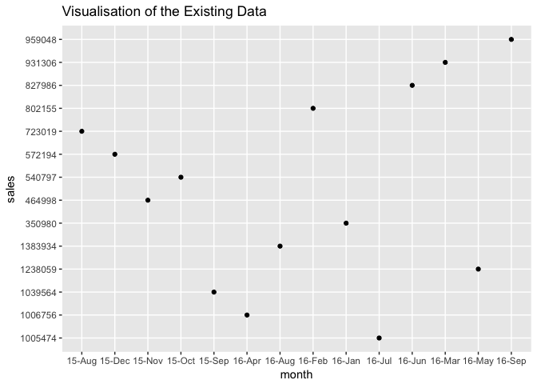
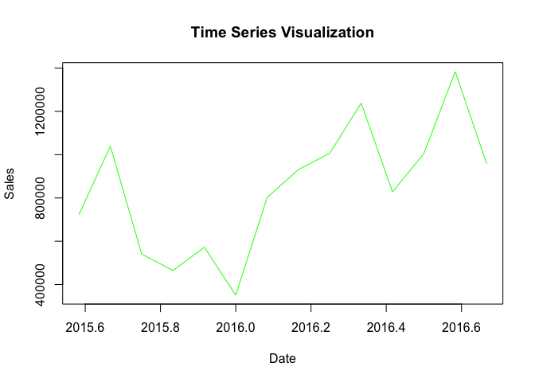
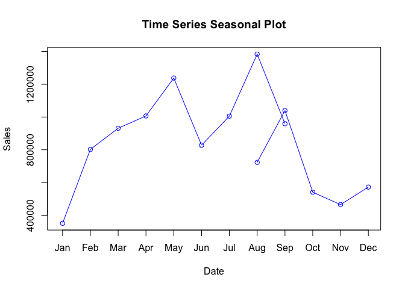
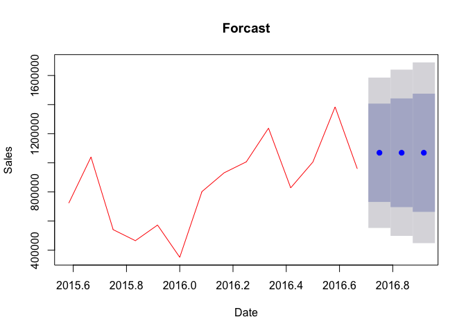

Applications of R language - Data Analyst Interview
================
Alina Skripets
October 25, 2017

### Agenda

1.  Introduction
2.  Data cleaning
3.  Simple data manipulation
4.  Forecasting

------------------------------------------------------------------------

**Introduction**

A year ago, I was looking for a summer internship and stumbled upon DangFoods.Inc The official position was *Dang Financial Intern*.


The job implied working a lot with data entry and processing. Sounded like something I could handle and so after reading the job posting I embarked on the journey of applying and interviewing. The first two rounds of the interview went smoothly, all the way up until the moment that my skills and knowledge were put to the test. One morning I received the following email:

> <font size="2"> Hi Alina,
>
> Please complete the following tasks and email back before 6pm PST today. Please confirm receipt of this email.
> 1. Complete this online test and send me a screenshot of your score. Honor code for doing this on your own (and not opening up excel):
> (<http://www.skills-assessment.net/home/frmIndex.aspx?e=135>)
>
> 1.  In the attached excel file, there are a list of customers and their dollar sales in each month. Please determine the following and send back the file with your work shown:
>
> -   Largest 10 customers in 2016, ranked
> -   A graph of total dollar sales in 2016, by month
> -   The largest single customer in Sep 16
> -   The customer with the largest dollar increase in sales from Aug 16 to Sep 16
> -   The customer with the largest percent increase in sales from Feb 16 to Mar 16
> -   Using this raw data, forecast (model) total dollar sales for remaining 2016 months. Please describe model and assumptions you used.
>     If you cannot finish all tasks before 6pm, that's okay, please send me what you've done. Good luck!
>
> Thanks! </font>

It was implied that I could work in excel or any other software, but unfortunately, at the time, I only knew vba, which is excel programming language. **Spoiler alert**: I failed this interview spectacularly. However, in retrospect, had I known R, not only would I be able to fulfill all the tasks, but also wow the interviewers with some powerful data processing.

First, I would like to note why it is that excel was such a bad choice of platform for this interview. There are numerous advantages of R over excel that can be named here. Of course, traditionally, excel is widely used by people with little knowledge of programming, while R is used by people specifically recognizing the need for a programming language to unlock new data analysis possibilities. However, for us, as students majoring in Statistics, it is important to realize the main advantages. The Fantasy Football Analytics blog offers [14 reasons why R is better than Excel](http://fantasyfootballanalytics.net/2014/01/why-r-is-better-than-excel.html) for data analysis. In my opinion the most important ones are:

-   Easier automation
-   It reads any type of data
-   Easier project organization
-   It supports larger data sets
-   State-of-the-art graphics

In the context of the interview, we could just load the excel into R and using Markdown, we could produce a clean and presentable html output. Lets explore how all the five advantages of R come into play while we perform with ease the tasks from the interview email above.

------------------------------------------------------------------------

**Data Cleaning**

First of all, let's take a look at our excel file. We might need to do some data cleaning first. Just for reference, below is the raw state of the data:


What do we like about this data? \* Every cell has a value \* Format of the cells is the same.

What don't we like? \* Some groups have subgroups \* Some columns have no input (columns E, G etc)

``` r
library(dplyr)
```

    ## Warning: package 'dplyr' was built under R version 3.4.2

    ## 
    ## Attaching package: 'dplyr'

    ## The following objects are masked from 'package:stats':
    ## 
    ##     filter, lag

    ## The following objects are masked from 'package:base':
    ## 
    ##     intersect, setdiff, setequal, union

``` r
library(readr)
library(ggplot2)
#install.packages('forecast')
library(forecast)
```

    ## Warning: package 'forecast' was built under R version 3.4.2

``` r
month <- c('X1', 'Client', 'Subclient', '15-Aug', 'X2', '15-Sep', 'X3','15-Oct', 'X4','15-Nov', 'X5','15-Dec','X6','16-Jan', 'X7',
       '16-Feb','X8',
       '16-Mar','X9',
       '16-Apr','X10',
       '16-May','X11',
       '16-Jun','X12',
       '16-Jul','X13',
       '16-Aug','X14',
       '16-Sep')
raw <- read_csv("gross_sales_raw.csv", col_names = month)
```

    ## Parsed with column specification:
    ## cols(
    ##   .default = col_character()
    ## )

    ## See spec(...) for full column specifications.

``` r
raw <- raw[-1, ]
raw[1:3,1:7]
```

    ## # A tibble: 3 x 7
    ##      X1                     Client Subclient `15-Aug`    X2 `15-Sep`    X3
    ##   <chr>                      <chr>     <chr>    <chr> <chr>    <chr> <chr>
    ## 1  <NA>                A Class Act      <NA>        0  <NA>        0  <NA>
    ## 2  <NA> Abraham Natural Foods Corp      <NA> 3,556.80  <NA>        0  <NA>
    ## 3  <NA>     Albertsons (SuperValu)      <NA>        0  <NA> 3,778.56  <NA>

Let's get rid of the empty columns first, to make the data cleaner.

``` r
c <- c(2,3,seq(from = 4, to = 30, by=2))
raw <- select(raw, c)
raw <- type_convert(raw, c(col_character(), col_character(), rep(col_double(), 14)))
raw[1:3, 1:6]
```

    ## # A tibble: 3 x 6
    ##                       Client Subclient `15-Aug` `15-Sep` `15-Oct` `15-Nov`
    ##                        <chr>     <chr>    <dbl>    <dbl>    <dbl>    <dbl>
    ## 1                A Class Act      <NA>      0.0     0.00      144     0.00
    ## 2 Abraham Natural Foods Corp      <NA>   3556.8     0.00        0     0.00
    ## 3     Albertsons (SuperValu)      <NA>      0.0  3778.56        0  3778.56

Now our columns are nice and pretty. However there still is that second column that looks ugly. It contains the subclient name for the bigger relationships that are broken down into several profit-generating clients. We wouldn't care about individual subclients for the purposes of this research so we will not need the breakdown but rather would prefer to use the Total. For the subclients, there's a line with the client name followed by the breakdown of into a few lines, followed by the Total sales. Let's keep this organization in mind.


``` r
colnames(raw)[which(names(raw) == "X2")] <- "Client"
colnames(raw)[which(names(raw) == "X3")] <- "SubClient"
dim(raw)
```

    ## [1] 286  16

``` r
row.names(raw) <- seq(1, nrow(raw), 1)
```

    ## Warning: Setting row names on a tibble is deprecated.

``` r
raw[1:3, 1:6]
```

    ## # A tibble: 3 x 6
    ##                       Client Subclient `15-Aug` `15-Sep` `15-Oct` `15-Nov`
    ##                        <chr>     <chr>    <dbl>    <dbl>    <dbl>    <dbl>
    ## 1                A Class Act      <NA>      0.0     0.00      144     0.00
    ## 2 Abraham Natural Foods Corp      <NA>   3556.8     0.00        0     0.00
    ## 3     Albertsons (SuperValu)      <NA>      0.0  3778.56        0  3778.56

------------------------------------------------------------------------

**Simple Data Manipulation**

Now for the actual assignment. Here's what we've been asked to do to prove that we are worthy of being Dang Financial Analyst:

> <font size="2"> \* Largest 10 customers in 2016, ranked
> \* A graph of total dollar sales in 2016, by month
> \* The largest single customer in Sep 16
> \* The customer with the largest dollar increase in sales from Aug 16 to Sep 16
> \* The customer with the largest percent increase in sales from Feb 16 to Mar 16
> \* Using this raw data, forecast (model) total dollar sales for remaining 2016 months. Please describe model and assumptions you used.
> \* What other information would you request to hone in your forecast? </font>

We can easily locate the 10 largest customers in 2016 and rank them using dplyr. For this question we need a dataset with sales for 2016. We don't care about the clients that are broken down into subcients because obviously the Total sales would be greater than any sub-part.


``` r
#Select appropriate rows
q1 <- select(raw, 1, 2, 8:16)
#The rows that display NA for Client are the ones that contain input of subclients. Therefore, we can create a data frame of the actual clients by only picking the rows without NA.
clients <- row.names(q1)[which(is.na(q1$Client)==FALSE)]
clients <- as.integer(clients)
q1 <- q1[clients, ]
#Now q1 is our working dataset but we still have lines containing the name of a big client that are followed by the breakdown and the total. We have no need for those lines as they contain no data. We can use Total line instead, as in the picture above. 
cs <- row.names(q1)[which(is.na(q1$`16-Jan`)==FALSE)]
cs <- as.integer(cs)
q1 <- q1[cs, ]
#Now we have no need for row 2.
q1 <- select(q1, -2)
q1[1:3, 1:6]
```

    ## # A tibble: 3 x 6
    ##                       Client `16-Jan` `16-Feb` `16-Mar` `16-Apr` `16-May`
    ##                        <chr>    <dbl>    <dbl>    <dbl>    <dbl>    <dbl>
    ## 1                A Class Act      0.0        0     0.00        0     0.00
    ## 2 Abraham Natural Foods Corp   3704.4        0     0.00        0  3556.80
    ## 3     Albertsons (SuperValu)      0.0        0  3098.88        0  2833.92

Also instead of the breakdown by months, it would be more helpful to find the sum of the yearly sales for the purposes of the first few questions. As soon as that is done, we can easily find the largest customer.

``` r
q1$Total <- rowSums(q1[ ,2:10])
c <- c(1, 11)
q1 <- select(q1, 1, 11)
q1 %>%
  arrange(desc(Total)) %>%
  slice(1:10)
```

    ## # A tibble: 10 x 2
    ##                                         Client     Total
    ##                                          <chr>     <dbl>
    ##  1                             Total UNFI East 1794710.4
    ##  2 Total United Natural Foods West, Inc (UNFI) 1626268.8
    ##  3                     Total KeHE Distributors  724601.2
    ##  4                      Total Costco Wholesale  655914.0
    ##  5                                   Total DPI  422193.6
    ##  6                                  Amazon.com  388822.5
    ##  7                             Target - Direct  387915.1
    ##  8                            Chex Finer Foods  261599.4
    ##  9                          Total Dang Samples  223310.3
    ## 10                Grocery Outlet Bargin Market  212994.4

Now, on to the second question. &gt; The largest single customer in Sep 16

``` r
q2 <- select(raw, 1, 2, 16)
clients <- row.names(q2)[which(is.na(q2$Client)==FALSE)]
clients <- as.integer(clients)
q2 <- q2[clients, ]
cs <- row.names(q2)[which(is.na(q2$`16-Sep`)==FALSE)]
cs <- as.integer(cs)
q2 <- q2[cs, ]
q2 <- select(q2, -2)
```

Having obtained the dataset, we can perform the task easily using dplyr.

``` r
head(q2)
```

    ## # A tibble: 6 x 2
    ##                       Client `16-Sep`
    ##                        <chr>    <dbl>
    ## 1                A Class Act     0.00
    ## 2 Abraham Natural Foods Corp     0.00
    ## 3     Albertsons (SuperValu)   982.80
    ## 4              Allina Health     0.00
    ## 5                 Amazebowls     0.00
    ## 6      Amazon Seller Central   968.78

``` r
q2 %>%
  arrange(desc(`16-Sep`)) %>%
  slice(1)
```

    ## # A tibble: 1 x 2
    ##                   Client `16-Sep`
    ##                    <chr>    <dbl>
    ## 1 Total Costco Wholesale 245254.8

Moving on:

> <font size="2"> The customer with the largest dollar increase in sales from Aug 16 to Sep 16 </font>

We just pick the columns that we need from the raw data. Again, we get rid of the subclients column as we did in the previous part.

``` r
q3 <- select(raw, 1, 2, 15, 16)
clients <- row.names(q3)[which(is.na(q3$Client)==FALSE)]
clients <- as.integer(clients)
q3 <- q3[clients, ]
cs <- row.names(q3)[which(is.na(q3$`16-Sep`)==FALSE)]
cs <- as.integer(cs)
q3 <- q3[cs, ]
q3 <- select(q3, -2)
q3
```

    ## # A tibble: 157 x 3
    ##                        Client `16-Aug` `16-Sep`
    ##                         <chr>    <dbl>    <dbl>
    ##  1                A Class Act     0.00     0.00
    ##  2 Abraham Natural Foods Corp  3556.80     0.00
    ##  3     Albertsons (SuperValu)  3098.88   982.80
    ##  4              Allina Health     0.00     0.00
    ##  5                 Amazebowls     0.00     0.00
    ##  6      Amazon Seller Central  1336.59   968.78
    ##  7                 Amazon.com 55210.55 73058.24
    ##  8    Ampersand Entertainment     0.00     0.00
    ##  9                 AOJ Snacks     0.00     0.00
    ## 10           Artis Coffee Inc     0.00     0.00
    ## # ... with 147 more rows

And we are ready to find the largest increase over this period.

``` r
q3$Increase <- q3$`16-Sep` - q3$`16-Aug`
q3 %>%
  arrange(desc(Increase)) %>%
  slice(1)
```

    ## # A tibble: 1 x 4
    ##            Client `16-Aug` `16-Sep` Increase
    ##             <chr>    <dbl>    <dbl>    <dbl>
    ## 1 Total UNFI East 171327.6 203871.6    32544

Dang we are good at this!

And now... On to the next part. &gt; <font size="2"> The customer with the largest percent increase in sales from Feb 16 to Mar 16 </font>

This is pretty much the same as before. Now that we got a cleaner version of raw data, we can easily do this. Just one little problem - finding percentage increase involves division by zero for the new clients. Why don't we add a dollar to each client in Feb and in March. That would hardly influence who has the greatest percentage increase but we will be able to evaluate clients with 0 sales as of Feb.

``` r
q4 <- select(raw, 1, 2, 9, 10)
clients <- row.names(q4)[which(is.na(q4$Client)==FALSE)]
clients <- as.integer(clients)
q4 <- q4[clients, ]
cs <- row.names(q4)[which(is.na(q4$`16-Mar`)==FALSE)]
cs <- as.integer(cs)
q4 <- q4[cs, ]
q4$`16-Feb`[q4$`16-Feb`== 0] <- 1 
q4 <- mutate(q4, Mar = `16-Mar` + 1) 
q4 <- select(q4, -2, -4)
head(q4)
```

    ## # A tibble: 6 x 3
    ##                       Client `16-Feb`     Mar
    ##                        <chr>    <dbl>   <dbl>
    ## 1                A Class Act     1.00    1.00
    ## 2 Abraham Natural Foods Corp     1.00    1.00
    ## 3     Albertsons (SuperValu)     1.00 3099.88
    ## 4              Allina Health     1.00  708.52
    ## 5                 Amazebowls     1.00    1.00
    ## 6      Amazon Seller Central   455.88    1.00

Easy-peezy. Now we can evaluate the largest percentage increase.

``` r
q4$PercInc <- round((q4$Mar-q4$`16-Feb`)/q4$`16-Feb`, 2)*100
q4 %>%
  arrange(desc(PercInc)) %>%
  slice(1)
```

    ## # A tibble: 1 x 4
    ##          Client `16-Feb`     Mar PercInc
    ##           <chr>    <dbl>   <dbl>   <dbl>
    ## 1 Marvell Foods        1 35228.8 3522780

All done. Dplyr package really makes our life easier. On to the next task.

------------------------------------------------------------------------

**Forecasting**

> <font size="2"> \* Using this raw data, forecast (model) total dollar sales for remaining 2016 months. Please describe model and assumptions you used. </font>

Now this is more entertaining. R offers many ways to construct forecasts. The data we have been analysing can be described as a time series data best. Therefore, it makes sense to be analyzing and forcasting in the manner appropriate to our data. R has a special package developed for forecasting, time series in particular. The package I would like to discuss here is simply called forecast and a [short description of it](https://cran.r-project.org/package=forecast) can be found at CRAN. To mention a little bit of background, the package we introduced by Rob Hyndman just this September. The package is obviously really new and exciting. It adds to R's capabilities in the field of Econometrics and Time Series Analysis. It contains useful functions and built-in graphical tools to make it simpler to work with time series. The package contains some advanced mathematical models that we will not focus on deeply but we will instead pick a function called *forecast* and see what analysis we can perform on our data.


For more information on the package, please reference the [manual](https://cran.r-project.org/web/packages/forecast/forecast.pdf).

First, Lets prepare the data for analysis. We want as much data as we can get, going back in time as far as possible. Our data starts with August, 2015 which is when the Dang Foods startup started recording their sales. It ends with September 2016 and the rest of the year is up to us to forecast.

``` r
#Let's first get the correct dataset of this question.
q5 <- raw
colnames(q5) <- c('Client', 'Subclient', '15-Aug', '15-Sep', '15-Oct', '15-Nov', '15-Dec','16-Jan',
       '16-Feb',
       '16-Mar',
       '16-Apr',
       '16-May',
       '16-Jun',
       '16-Jul',
       '16-Aug',
       '16-Sep')
#Getting rid of subclients and getting rid of the non-informative lines.
#Just like we did before.
clients <- row.names(raw)[which(is.na(q5$Client)==FALSE)]
clients <- as.integer(clients)
q5 <- q5[clients, ]
cs <- row.names(raw)[which(is.na(q5$`16-Jan`)==FALSE)]
cs <- as.integer(cs)
q5 <- q5[cs, ]
q5 <- select(q5, -2)
#Now this is our working dataset. 
q5[1:3, 1:6]
```

    ## # A tibble: 3 x 6
    ##                       Client `15-Aug` `15-Sep` `15-Oct` `15-Nov` `15-Dec`
    ##                        <chr>    <dbl>    <dbl>    <dbl>    <dbl>    <dbl>
    ## 1                A Class Act      0.0     0.00      144     0.00        0
    ## 2 Abraham Natural Foods Corp   3556.8     0.00        0     0.00        0
    ## 3     Albertsons (SuperValu)      0.0  3778.56        0  3778.56        0

We also need sums over month, instead of individual clients. Don't judge too harshly, I had a little trouble figuring out how to put the dataset together properly and the following code below is the only way it would work out. Of course there has to be a more elegant way to do this. Please feel free to reach out with any suggestions.

``` r
#getting sums into a separate vector.
x <- c(0, sum(q5$`15-Aug`[1:157]),
       sum(q5$`15-Sep`[1:157]),
       sum(q5$`15-Oct`[1:157]),
       sum(q5$`15-Nov`[1:157]),
       sum(q5$`15-Dec`[1:157]),
       sum(q5$`16-Jan`[1:157]),
       sum(q5$`16-Feb`[1:157]),
       sum(q5$`16-Mar`[1:157]),
       sum(q5$`16-Apr`[1:157]),
       sum(q5$`16-May`[1:157]),
       sum(q5$`16-Jun`[1:157]),
       sum(q5$`16-Jul`[1:157]),
       sum(q5$`16-Aug`[1:157]),
       sum(q5$`16-Sep`[1:157]))
q5 <- rbind(q5, x)
tail(q5)
```

    ## # A tibble: 6 x 15
    ##                    Client `15-Aug`   `15-Sep`  `15-Oct` `15-Nov` `15-Dec`
    ##                     <chr>    <dbl>      <dbl>     <dbl>    <dbl>    <dbl>
    ## 1            Total Vistar      0.0       0.00      0.00      0.0      0.0
    ## 2             Weserv, Inc      0.0     205.44    205.44      0.0      0.0
    ## 3 Wheelys Cafe Long Beach      0.0       0.00      0.00      0.0      0.0
    ## 4               WorkPerks    153.6       0.00      0.00      0.0      0.0
    ## 5             Zoom Snacks      0.0       0.00      0.00      0.0      0.0
    ## 6                       0 723019.0 1039564.55 540797.20 464998.5 572194.9
    ## # ... with 9 more variables: `16-Jan` <dbl>, `16-Feb` <dbl>,
    ## #   `16-Mar` <dbl>, `16-Apr` <dbl>, `16-May` <dbl>, `16-Jun` <dbl>,
    ## #   `16-Jul` <dbl>, `16-Aug` <dbl>, `16-Sep` <dbl>

``` r
#binding it to the end of our dataset
q5 <- slice(q5, 158)
q5 <- select(q5, 2:10)
q5
```

    ## # A tibble: 1 x 9
    ##   `15-Aug` `15-Sep` `15-Oct` `15-Nov` `15-Dec` `16-Jan` `16-Feb` `16-Mar`
    ##      <dbl>    <dbl>    <dbl>    <dbl>    <dbl>    <dbl>    <dbl>    <dbl>
    ## 1   723019  1039565 540797.2 464998.5 572194.9 350980.9   802155 931306.3
    ## # ... with 1 more variables: `16-Apr` <dbl>

``` r
#keeping only months and the total sales data.
month <- c('15-Aug', '15-Sep', '15-Oct', '15-Nov', '15-Dec','16-Jan',
       '16-Feb',
       '16-Mar',
       '16-Apr',
       '16-May',
       '16-Jun',
       '16-Jul',
       '16-Aug',
       '16-Sep')
#sales data would come with attached months names, so I had to get those into a separate vector. 
sales <- c(723019.0, 1039564.5 , 540797.2, 464998.5, 572194.9,  350980.9,  802155.0,  931306.3, 1006756.5, 1238059.4,  827986.9, 1005474.3, 1383934.1,  959048.3)
sales <- as.integer(sales)
#Now we put the two vectors together into the dataset on which we can easily base our forcasts.
data <- as.data.frame(cbind(month, sales))
data
```

    ##     month   sales
    ## 1  15-Aug  723019
    ## 2  15-Sep 1039564
    ## 3  15-Oct  540797
    ## 4  15-Nov  464998
    ## 5  15-Dec  572194
    ## 6  16-Jan  350980
    ## 7  16-Feb  802155
    ## 8  16-Mar  931306
    ## 9  16-Apr 1006756
    ## 10 16-May 1238059
    ## 11 16-Jun  827986
    ## 12 16-Jul 1005474
    ## 13 16-Aug 1383934
    ## 14 16-Sep  959048

We can easily visualize data using ggplot. It seems difficult to make a coherent prediction because we have only a few months of data and the sales amounts are all over the place.

``` r
ggplot(data, aes(x = month, y = sales)) + 
  geom_point() +
  ggtitle("Visualisation of the Existing Data")
```



This is all great but for the purposes of the **forecast** package, we need it in a form of time series. Conveniently, R stats package provides function ts() to make a dataset into a time series. All we need to do is specify the start date of the time series, the end date of the time series and the number of the observations per year.

``` r
ts <- ts(sales, start=c(2015, 8), end = c(2016, 9), frequency = 12)
ts
```

    ##          Jan     Feb     Mar     Apr     May     Jun     Jul     Aug
    ## 2015                                                          723019
    ## 2016  350980  802155  931306 1006756 1238059  827986 1005474 1383934
    ##          Sep     Oct     Nov     Dec
    ## 2015 1039564  540797  464998  572194
    ## 2016  959048

To help us visualize the time series, let's take a look at some plots.

``` r
plot(ts, ylab="Sales", xlab="Date", main="Time Series Visualization", col='green')
```



Above is the simplest graph created using the stats package. We can also graph a time series using season plot. On the graph below we see that sales for Aug 16 and Aug 15 differ drastically. This indicates to me that even if we forecast the sales for a few months of 2016, it is hardly a good prediction of how the business is going to develop.

``` r
seasonplot(ts, ylab="Sales", xlab="Date", main="Time Series Seasonal Plot", col='blue')
```



The forcast package has its own plotting capabilities. Here's were the package comes in really handy for the purposes of our research. The main function we will need is 'forcast'. Forecast is a generic function for forecasting from time series. The function can automatically invoke a particular method which depends on the class of the first argument. We will input our time series into the function and specify that we need a prediction of 3 periods into the future. We are also allowed to specify confidence level for prediction intervals but we will leave at a default of 5%.

How does the function calculate its predictions? According to the Hyndman's [presentation](https://robjhyndman.com/talks/MelbourneRUG.pdf) the function is capable of distinguishing between several methods.

1.  Mean - Forecast of all future values is equal to mean of historical data
2.  Naïve - Forecasts equal to last observed value
3.  Seasonal - Forecasts equal to last value from same season.
4.  Drift - Forecasts equal to last value plus average change.

Mean is a default so we will just use it for simplicity.

``` r
#Creating object of the class 'forecast'. 
forecast <- forecast(ts, 3)
forecast
```

    ##          Point Forecast    Lo 80   Hi 80    Lo 95   Hi 95
    ## Oct 2016        1069027 731257.3 1406797 552452.7 1585601
    ## Nov 2016        1069027 695605.2 1442449 497927.5 1640127
    ## Dec 2016        1069027 663072.1 1474982 448172.6 1689882

Now lets examine what the forcast object consists of. According to one of the helpful [Stack overflow notes](https://stackoverflow.com/questions/39398460/how-to-create-a-forecast-object-in-r), forecast object is just a list containing a few items, and given a class "forecast". The list contains the actual numeric forcast for Oct, Nov, Dec, constructed based on the mean of the previous months, and various confidence levels with corresponding values. Let us graph this object to help visualize the prediction.

``` r
plot(forecast, main='Forecast', ylab='Sales', xlab='Date', col='red')
```



Just as we thought, the prediction is vague due to limited data and big variations in sales that are a trait of a startup. Hyndman's package offers a way to estimate accuracy of our forecast, as expalained in more detains in his [presentation](https://www.r-bloggers.com/time-series-analysis-using-r-forecast-package/). The syntax is straight forward. We just need to indicate the object of type forecast.

``` r
accuracy <- accuracy(forecast)
accuracy
```

    ##                    ME     RMSE      MAE       MPE     MAPE      MASE
    ## Training set 45764.46 263563.2 237314.1 -4.076772 31.06296 0.6401514
    ##                     ACF1
    ## Training set -0.03329664

**ME: Mean Error**
RMSE: Root Mean Squared Error
MAE: Mean Absolute Error
**MPE: Mean Percentage Error**
MAPE: Mean Absolute Percentage Error
MASE: Mean Absolute Scaled Error
ACF1: Autocorrelation of errors at lag 1

Just by looking at the mean error and the mean percentage error, we understand that our forecast is not very inaccurate. On average our prediction may be off by $46,000 which seems like a lot.

There are other ways to forecast he sales using the forecast package such as Holt Winters analysis and exponential analysis but we won't delve into those here. More information can be found [here](https://stat.ethz.ch/R-manual/R-devel/library/stats/html/HoltWinters.html).

------------------------------------------------------------------------

**Conclusion**

We showed that the tasks mentioned in the interview e-mail can easily be performed using R. However, to be honest, it does take time to clean up the data in order to be able to use it effectively in R. Therefore in case of limited time, we might have some trouble using R for the interview purposes. R package called forecasting offers many useful tools to analyze and predict time trends. However, we need to keep in mind limitations of our data and not reply heavily on the forecasts made but rather use them as guidelines to the likely events.

------------------------------------------------------------------------

**Links and References**:
[Why is R better than Excel (Fantasy Football)](http://fantasyfootballanalytics.net/2014/01/why-r-is-better-than-excel.html)
[CRAN page for forecast package](https://cran.r-project.org/package=forecast)
[Hyndman's presentation of the Forecast package in Melbourne](https://robjhyndman.com/talks/MelbourneRUG.pdf)
[Stack Overflow page on what a forecast objects in R](https://stackoverflow.com/questions/39398460/how-to-create-a-forecast-object-in-r)
[Breakdown of the Forecast package objects and functions in a blog](https://www.r-bloggers.com/time-series-analysis-using-r-forecast-package/)
[More detailed information on different forcasting methods included in forecast package](https://stat.ethz.ch/R-manual/R-devel/library/stats/html/HoltWinters.html)
[Forecasting time series - comments and suggestions](https://www.statmethods.net/advstats/timeseries.html) [Reference Manual for R forecast package](https://cran.r-project.org/web/packages/forecast/forecast.pdf)
