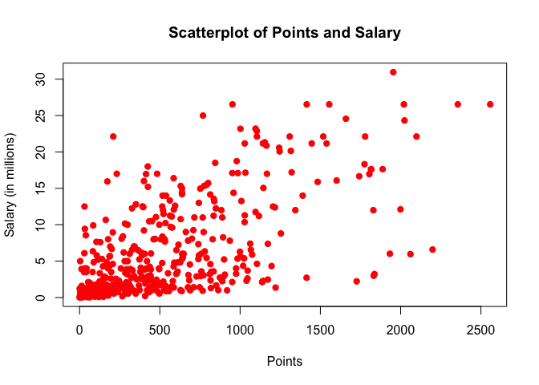
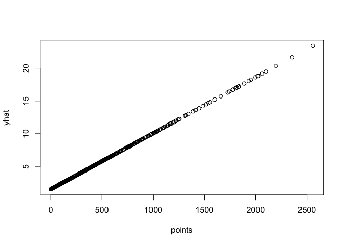
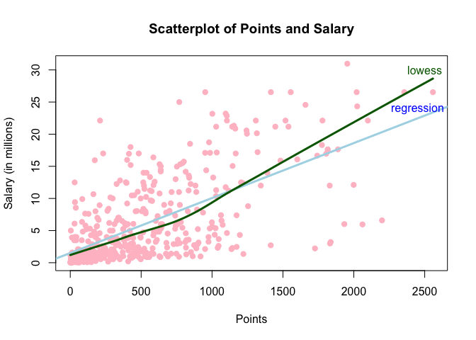
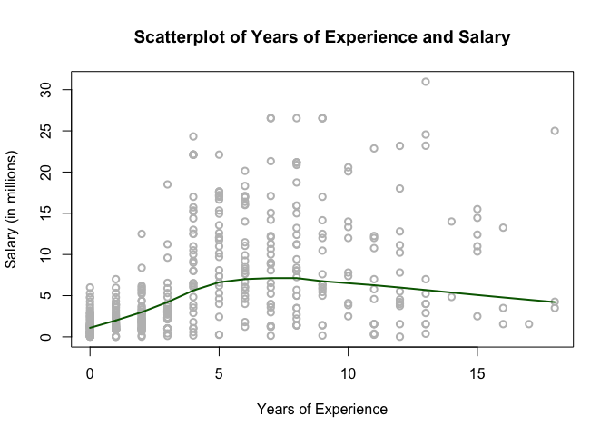
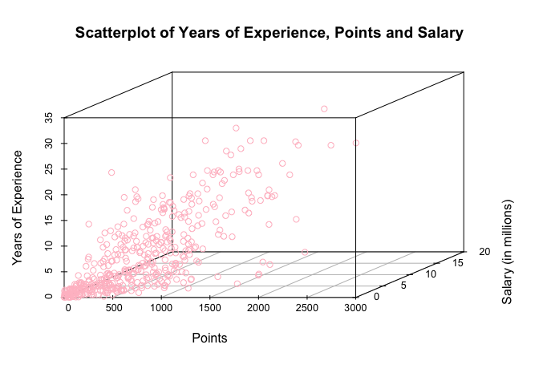
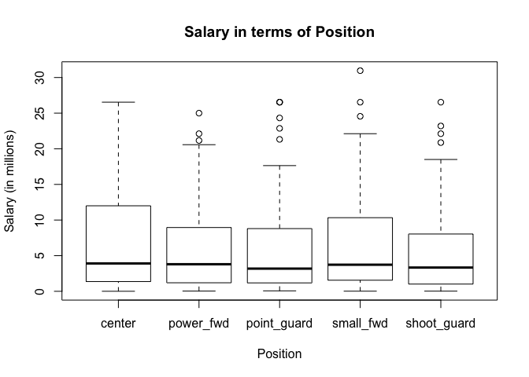

hw01-Alina-Skripets
================
Alina Skripts
September 19, 2017

Homework 1
==========

First we load the data.

``` r
rm(list = ls())
setwd("/Users/Alina 1/stat133/stat133-hws-fall17/hw01")
load("data/nba2017-salary-points.RData")
```

Let us see what we have in this data file:

``` r
ls()
```

    ## [1] "experience" "player"     "points"     "points1"    "points2"   
    ## [6] "points3"    "position"   "salary"     "team"

We will be answering this question: **“Is it true that the more points a player scores, the higher his salary is?”**

A bit of data preprocessing
---------------------------

The variable salary is measured in dollars. In order to have a more convenient measurement scale, we now create a new salary variable measured in millions of dollars, up to 2 decimal digits.

``` r
salary.mill <- salary/1000000
```

We also want to set up a integer vector of experiences. First, we convert experience vaues into inegers and let R convert status "rookie" into NA. Next, we need to replace NAs by 0.

``` r
experience.int <- as.integer(experience)
```

    ## Warning: NAs introduced by coercion

``` r
na.zero <- function (x) 
  {x[is.na(x)] <- 0
    return(x)}
exp.na.0 <- na.zero(experience.int)
```

Done! Let's also convert position vector into factor and make factor levels names more descriptive.

``` r
as.factor(position)
```

    ##   [1] C  PF SG PG SF PG SF SG SF PF PF C  SG PG C  C  SF PG PF C  SG SG SF
    ##  [24] PG PF SG PG SF SF C  SF SG PG SG SF PG C  C  PG C  SG SF PF PF PF SF
    ##  [47] SG PG PF C  C  C  PG C  PF SF SG SG PG SF PG C  PF PG SF PF PG SF C 
    ##  [70] PF PF SF SG SF C  PF SG C  SF SG PG PF PF SG PF C  SG PG C  SF PF PG
    ##  [93] PG PF SG PF SG C  SF PF PF SG PF PG C  SG SG SG PG SF C  PG PF SF PG
    ## [116] C  SG PG C  PF PF SG SF SF PF SG PG C  SG C  C  C  PG C  SG PF PG PF
    ## [139] SG SF SG SF PG SF PF PG PG PF PF C  SG PF PG SG PF SF C  SG PG SG SF
    ## [162] PG SG PG C  SG PF C  PF C  PF SF SG SG C  SF C  PG PG SF PG SG PF SG
    ## [185] SG SF C  SG C  SF PF PF SG C  PG C  SF SG C  SF PG C  PG C  SF PF SG
    ## [208] C  SF PG PG SG C  SF PF SG SF SG PG PF SF C  C  PF SG PF C  SF C  SG
    ## [231] SF SG PG PG C  SG SG PF PF PG C  C  SG SF SG PF SG PG C  PG PG C  C 
    ## [254] SG PG PG PF SG C  SG PF SF SF SF SF SG PF PF PF PG C  C  SG SG SF C 
    ## [277] SF PG SF SG PF PG PF PG SF C  SF SF PF PG SG C  PG PF SG SF PF SF C 
    ## [300] SF PF SF PF PG PG PG C  PF SG PG PF SF C  SF PF PF C  PG SG SG SF PG
    ## [323] SG PF SF SG SG PG PF SF SF C  SF PF PF SG PG SG SF PF PG SG SG PG PF
    ## [346] PF SG C  SF C  C  SG SF C  C  SF PF SF C  PF SG SG PG C  PG SF PG C 
    ## [369] SG PG PF PF C  PF PG PF C  SF C  PG SG PG PF SG SG SG PG SG C  C  PG
    ## [392] SG SF PF PG SF C  PF SF SG C  PF C  C  PG PF SF PG SF PG SG SF SF PG
    ## [415] SG C  SG PF PF SF SF SG C  PF C  PG C  C  SG SF SG PF SG PG PF SG PF
    ## [438] PG SF PG C 
    ## Levels: C PF PG SF SG

``` r
position.fac <- factor(position)
is.factor(position.fac)
```

    ## [1] TRUE

``` r
levels(position.fac)
```

    ## [1] "C"  "PF" "PG" "SF" "SG"

``` r
levels(position.fac)[1] <- "center"
levels(position.fac)[2] <- "power_fwd"
levels(position.fac)[3] <- "point_guard"
levels(position.fac)[4] <- "small_fwd"
levels(position.fac)[5] <- "shoot_guard"

levels(position.fac)
```

    ## [1] "center"      "power_fwd"   "point_guard" "small_fwd"   "shoot_guard"

Now we can creat a table and calculate frequencies of each level.

``` r
table(position.fac)
```

    ## position.fac
    ##      center   power_fwd point_guard   small_fwd shoot_guard 
    ##          89          89          85          83          95

``` r
frequency.pos <- table(position.fac)/5
frequency.pos
```

    ## position.fac
    ##      center   power_fwd point_guard   small_fwd shoot_guard 
    ##        17.8        17.8        17.0        16.6        19.0

Having figured that out, we are moving to the next part.

Scatterplot of Points and Salary
================================

We will begin by constructing a scatterplot.

``` r
s.plot <- salary/1000000
plot(points,s.plot,
pch = 20,
col = "red",
xlab = "Points",
ylab = "Salary (in millions)",
main = "Scatterplot of Points and Salary",
cex = 1.5)
```

 Examining the graph, we can tell that there is a positive relationship: the more points the player scores - the greater his/her salary.The majority of points are concentrated in the lower left quadrant, with multiple outlyer that signify that the mean of the distribution is greater than the median and the tail is skewed to the right. From the data we can tell that that there's a farely strong positive relationship between points and salary, indicating that on average, the more a player scores, the more he/she earns. We cound estimate r around +0.7.

Correlation between Points and Salary
=====================================

We can use an R function for that.

``` r
cor(points,salary)
```

    ## [1] 0.6367043

Or we can do this mannually. We have number of individuals equal to 441. Lets also calculate x to be the mean of points and y to be mean of salary.

``` r
n <- length(player)
x <- sum(points)/n
y <- sum(salary)/n/1000000
varx <- (sum((points-x)^2))/(n-1)
vary <- (sum((salary.mill-y)^2))/(n-1)
sdx <- sqrt(varx)
sdy <- sqrt(vary)
cov <- (sum((points-x)*(salary.mill-y)))/(n-1)
corr <- cov/(sdx*sdy)
```

We get a correlation of 0.6367043. Just as we predicted (almost).

Simple Linear Regression
========================

Here is b1 the slope term:

``` r
b1 <- corr*(sdy/sdx)
b0 <- y-b1*x
yhat <- b0+points*b1
```

Now we are ready to answer questions:

Provide answers to the following questions:
-------------------------------------------

-   Summary statistics (use summary()) of Yˆ .

``` r
summary(yhat)
```

    ##    Min. 1st Qu.  Median    Mean 3rd Qu.    Max. 
    ##   1.510   2.845   5.206   6.187   8.184  23.398

-   What is the regression equation? It is
-   How do you interpret the slope coefficient b1? *It indicates strong positive relationship between salary and points. The least square line (regression line) has a positive slope.*

``` r
plot(points,yhat)
```



-   How do you interpret the intercept term b0? *Technically, this is the value of salary that is predicted to be paid to a player that hasn't scored even once. However, if the data didn't contain any points at 0 or close, these results are an intrapolation. It is unreliable prediction but it remains mathematically the intercept of the regression.*

-   What is the predicted salary for a player that scores:

``` r
s0 <- yhat[points==0]
s0
```

    ## [1] 1.509886

``` r
s100 <- yhat[points == 100]
s100
```

    ## [1] 2.365554

``` r
s500 <- b0+b1*500
s500
```

    ## [1] 5.788226

``` r
s1000 <- b0+b1*1000
s1000
```

    ## [1] 10.06657

``` r
s2000 <- b0+b1*2000
s2000
```

    ## [1] 18.62325

Plotting the regression line
============================

Now we make a second scatterplot of Points and Salary using and this time include the regression line.

``` r
graph = plot(points,salary.mill,
pch = 20,
col = "pink",
xlab = "Points",
ylab = "Salary (in millions)",
main = "Scatterplot of Points and Salary",
cex = 1.5)
reg = abline(b0, b1, lwd=3, col="lightblue")
lines(lowess(xy.coords(points, salary.mill)), col = "darkgreen", lwd=3)
text (2500, 30, "lowess", col="darkgreen")
text(2450,24, "regression", col="blue")
```



Regression residuals and Coefficient of Determination.
======================================================

We will create a scatterplot of Years-of-Experience and Salary, including a lowess smooth line (locally weighted scatterplot smoothing).

``` r
plot(exp.na.0,salary.mill, col="grey", lwd=2, xlab = "Years of Experience",
ylab = "Salary (in millions)",
main = "Scatterplot of Years of Experience and Salary",)
lines(lowess(xy.coords(exp.na.0,salary.mill)), col="darkgreen", lwd=2)
```



In this plot we see that salsry is evenly distributed between players of various experiences. It peaks around 6-7 years of experience, which should be because players arein a prime physical condition and they have enough experience to be valuable to the team. From then on, salary decreases with more years. There is a logical dependence and it can be seen in the graph.

Let us quickly install a package that we would need for 3D graphs.

``` r
#install.packages("scatterplot3d")
library(scatterplot3d)
scatterplot3d(points, exp.na.0, salary.mill, col <- "pink", xlab = "Points",
ylab = "Salary (in millions)", zlab = "Years of Experience",
main = "Scatterplot of Years of Experience, Points and Salary")
```



In the 3D plot, we can notie that there is a positie relationship both between points and salary and between points and years of experience. The plane slopes up and to the right. We note that the majority of the points lie close to the origin. That means that most scores an amount of points under 1500 and under 15 years of experience. It is a little hard to visulize the corresponding salary, though.

We can also creat a boxplot of Salary in terms of Position.

``` r
boxplot(salary.mill ~ position.fac, xlab = "Position",
ylab = "Salary (in millions)",
main = "Salary in terms of Position")
```



We can clearlt see here that mean salary in terms of position is about the same for any position but the distribution is less tight for center and small forward. We also note that each catigory has a few outliers. Most players earn under 12 million but over 2 million. Distributions are heaily skewed to the right.

**From the scatterplots, does Experience seem to be related with Salary?**

It seem to have a non linear relationship. Salary increases at a diminishing rate up until 6-7 years. However, after that, the salary decreases slowly.

**From the boxplot, does Position seem to be related with Salary?**

I would conclude that such relationship does not exist. Each position has roughly same boxplot.

Comments and Reflections
========================

<table>
<colgroup>
<col width="58%" />
<col width="41%" />
</colgroup>
<thead>
<tr class="header">
<th>Question</th>
<th>Answer</th>
</tr>
</thead>
<tbody>
<tr class="odd">
<td>What things were hard, even though you saw them in class?</td>
<td>Setting up new vectors and operations with vectors were hard just because they took time and felt unnatural.</td>
</tr>
<tr class="even">
<td>What was easy(-ish) even though we haven’t done it in class?</td>
<td>Adjusting all the settings of all the graphs.</td>
</tr>
<tr class="odd">
<td>If this was the first time you were using git, how do you feel about it?</td>
<td>I used git in the lab before. No problem, just takes some getting used to.</td>
</tr>
<tr class="even">
<td>If this was the first time using GitHub, how do you feel about it?</td>
<td>Is GitHub same as git? Either way, no problem so far.</td>
</tr>
<tr class="odd">
<td>Did you need help to complete the assignment? If so, what kind of help? Who helped you?</td>
<td>No, no help, all on my own. So proud.</td>
</tr>
<tr class="even">
<td>How much time did it take to complete this HW?</td>
<td>A few hours, actually.</td>
</tr>
<tr class="odd">
<td>What was the most time consuming part?</td>
<td>Getting all the lines to the graph (lowess and regression) and adjusting units of salary in millions everywhere.</td>
</tr>
<tr class="even">
<td>Was there anything that you did not understand? or fully grasped?</td>
<td>Nope, everything is clear now. I wish I knew how to make scatterplot points shaded according to density.</td>
</tr>
<tr class="odd">
<td>Was there anything frustrating in particular?</td>
<td>I was tring to install a package called &quot;homonym&quot; haha Also, adding a regression line with abline kept not working.</td>
</tr>
<tr class="even">
<td>Was there anything exciting? Something that you feel proud of? (Don’t be shy, we won’t tell anyone).</td>
<td>I think I enjoyed getting through it all. In particular, the parts that I struggled with most.</td>
</tr>
</tbody>
</table>
