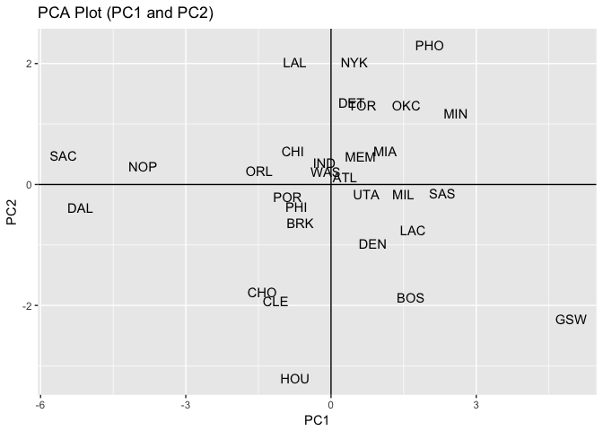

hw03-alina-skripets
================
Alina Skripets
October 10, 2017

About the Research Question
===========================

In this assignment you will focus on a hypothetical question: If you had to come up with a ranking system for the teams, how would you rank them?

To make things more interesting, let’s pretend that the NBA does not work the way it does. Let’s also pretend that the only available data is the player statistics, and nothing else. In other words, we don’t know the number of wins (and losses) of each team, or which team won the championship. Moreover, let’s assume there is no such championship. All we have is the information about the players, and the goal is to find a ranking for the teams.

If these assumptions and the ranking idea seem awkward, think about the ranking systems of universities, the ranking of companies in a certain industry, or the ranking of countries according to some economic or socio-demographic indicators (see examples below): • U.S. News National University Rankings • U.S. News Overall Best Countries Ranking • Fortune Tech The 30 Best Workplaces in Technology

In this assignment, you are going to consider different ways to rank the NBA teams. From simple rankings based on a given observed variable, to rankings based on derived indices like efficiency (i.e. EFF), to rankings based on a composite index using Principal Component Analysis (PCA).

Ranking of Teams
================

The analysis stage of this assignment has to do with looking at various ways to rank the teams. Use an Rmd file for this part of your project.

Basic Rankings
==============

Start by ranking the teams according to salary, arranged in decreasing order. Use ggplot() to create a barchart (horizontally oriented), like the one shown below. The vertical red line is the average team salary. You will have to look at the following resources to learn how to obtain such type of ggplot. • Horizontal barplot in ggplot <https://stackoverflow.com/questions/10941225/horizontal-barplot-in-ggplot2> • axis labels in ggplot2 <http://ggplot2.tidyverse.org/reference/labs.html>

``` r
rm(list=ls())
library(ggplot2)
library(readr)
library(dplyr)
```

    ## Warning: package 'dplyr' was built under R version 3.4.2

    ## 
    ## Attaching package: 'dplyr'

    ## The following objects are masked from 'package:stats':
    ## 
    ##     filter, lag

    ## The following objects are masked from 'package:base':
    ## 
    ##     intersect, setdiff, setequal, union

``` r
data <- read_csv('hw03/data/nba2017-teams.csv')
```

    ## Parsed with column specification:
    ## cols(
    ##   team = col_character(),
    ##   experience = col_integer(),
    ##   salary = col_double(),
    ##   points3 = col_integer(),
    ##   points2 = col_integer(),
    ##   free_throws = col_integer(),
    ##   points = col_integer(),
    ##   off_rebounds = col_integer(),
    ##   def_rebounds = col_integer(),
    ##   assists = col_integer(),
    ##   steals = col_integer(),
    ##   blocks = col_integer(),
    ##   turnovers = col_integer(),
    ##   fouls = col_integer(),
    ##   efficiency = col_double()
    ## )

``` r
#as.factor(data$team)
```

``` r
h1=mean(data$salary)
ggplot(data, aes(x = reorder(team, salary), y = salary)) + 
  geom_bar(stat='identity', fill = 'grey') + 
  coord_flip() + 
  geom_abline(aes(slope = 0, intercept = h1), color = 'red', size = 2, alpha = 0.5) + 
  ggtitle("NBA Teams ranked by Total Salary") +
  labs(y = "Salary (in millions)", x = "Team")
```


Create another bar chart of teams ranked by total points. The vertical red line is the average team points.

``` r
h2=mean(data$points)
ggplot(data, aes(x = reorder(team, points), y = points)) + 
  geom_bar(stat='identity', fill = 'grey') + 
  coord_flip() + 
  geom_abline(aes(slope = 0, intercept = h2), color = 'red', size = 2, alpha = 0.5) + 
  ggtitle("NBA Teams ranked by Total Points") +
  labs(y = "Total Points", x = "Team")
```


Use efficiency to obtain a third kind of ranking, and create an associated bar chart of teams ranked by total efficiency. The vertical red line is the average team efficiency.

``` r
h3=mean(data$efficiency)
ggplot(data, aes(x = reorder(team, efficiency), y = efficiency)) + 
  geom_bar(stat='identity', fill = 'grey') + 
  coord_flip() + 
  geom_abline(aes(slope = 0, intercept = h3), color = 'red', size = 2, alpha = 0.5) + 
  ggtitle("NBA Teams ranked by Total Efficiency") +
  labs(y = "Total Efficiency", x = "Team")
```


Provide concise descriptions of the obtained rankings so far.
=============================================================

Principal Components Analysis (PCA)
===================================

Perform a principal components analysis (PCA) on the following variables, to use the first principal component (PC1) as another index to rank the teams: • points3 • points2 • free\_throws • off\_rebounds • def\_rebounds • assists • steals • blocks • turnovers • fouls Use prcomp()—NOT to confuse with princomp()—to perform a PCA, specifying the argument scale. = TRUE (i.e. PCA on standardized data).

``` r
a <- cbind(data$points3, data$points2, data$free_throws, data$off_rebounds, data$def_rebounds, data$assists, data$steals, data$blocks, data$turnovers, data$fouls)
a <- as.data.frame(a)
pc <- prcomp(a, scale.=TRUE, center = TRUE)
pc <- pc[[5]][ ,1:2]
fin <- cbind(data$team, pc)
fin  <- as.data.frame(fin)
colnames(fin) <- c('Team', 'PC1', 'PC2')
fin$PC1 <- as.numeric(as.character(fin$PC1))
fin$PC2 <- as.numeric(as.character(fin$PC2))
str(fin)
```

    ## 'data.frame':    30 obs. of  3 variables:
    ##  $ Team: Factor w/ 30 levels "ATL","BOS","BRK",..: 1 2 3 4 5 6 7 8 9 10 ...
    ##  $ PC1 : num  0.288 1.648 -0.638 -0.789 -1.421 ...
    ##  $ PC2 : num  0.128 -1.868 -0.641 0.549 -1.772 ...

``` r
ggplot(fin, aes(x = PC1, y=PC2)) + 
  geom_text(aes(label = Team)) + 
  ggtitle("PCA Plot (PC1 and PC2)") + 
geom_abline(intercept=0, slope=0) +
  geom_abline(intercept = 0, slope=999999999)
```



Index based on PC1
------------------

In order to build an index based on the first PC, you are going to transform PC1. To get a more meaningful scale, you can rescale the first PC with a new scale ranging from 0 to 100. Let z1 be the first principal component. The transformed score s1, ranging on a scale from 0 to 100, can be obtained as: s1 = 100 × z1 − min(z1) max(z1) − min(z1)

``` r
s1 <- 100*((fin$PC1-min(fin$PC1))/(max(fin$PC1)-min(fin$PC1)))
s1
```

    ##  [1]  55.471897  68.432930  46.640314  45.199683  39.169120  41.824445
    ##  [7]   3.357322  60.950042  56.754305 100.000000  45.633232  51.394292
    ## [13]  68.862721  45.619512  58.511713  63.359160  66.968243  77.280477
    ## [19]  15.660728  57.304183  67.554140  38.580520  45.905162  72.163434
    ## [25]  44.174106   0.000000  74.645300  58.891926  59.690765  51.680440

``` r
finfin <- data.frame(s1=s1, team=data$team)
finfin
```

    ##            s1 team
    ## 1   55.471897  ATL
    ## 2   68.432930  BOS
    ## 3   46.640314  BRK
    ## 4   45.199683  CHI
    ## 5   39.169120  CHO
    ## 6   41.824445  CLE
    ## 7    3.357322  DAL
    ## 8   60.950042  DEN
    ## 9   56.754305  DET
    ## 10 100.000000  GSW
    ## 11  45.633232  HOU
    ## 12  51.394292  IND
    ## 13  68.862721  LAC
    ## 14  45.619512  LAL
    ## 15  58.511713  MEM
    ## 16  63.359160  MIA
    ## 17  66.968243  MIL
    ## 18  77.280477  MIN
    ## 19  15.660728  NOP
    ## 20  57.304183  NYK
    ## 21  67.554140  OKC
    ## 22  38.580520  ORL
    ## 23  45.905162  PHI
    ## 24  72.163434  PHO
    ## 25  44.174106  POR
    ## 26   0.000000  SAC
    ## 27  74.645300  SAS
    ## 28  58.891926  TOR
    ## 29  59.690765  UTA
    ## 30  51.680440  WAS

Once you have obtained the rescaled PC1, you can produce a barchart like the previous ones:

``` r
ggplot(finfin, aes(x = reorder(team, s1), y = s1)) + 
  geom_bar(stat='identity', fill = 'grey') + 
  coord_flip() + 
  geom_abline(aes(slope = 0, intercept = h3), color = 'red', size = 2, alpha = 0.5) + 
  ggtitle("NBA Teams ranked by Total Efficiency") +
  labs(y = "First PC (scaled from 0 to 100)", x = "Team")
```


We can see that GSW came out on the top according to the new rating. \#\#Comments and Reflections Reflect on what was hard/easy, problems you solved, helpful tutorials you read, etc.
Was this your first time working on a project with such file structure? If yes, how do you feel about it?
Yes, it wasn't hard until it came up on the midterm.
Was this your first time using relative paths? If yes, can you tell why they are important for reproducibility purposes?
Yes, and yes, they are much easier.
Was this your first time using an R script? If yes, what do you think about just writing code?
No, I used it in the lab before.
What things were hard, even though you saw them in class/lab?
It was okay, just took some creative thinking and lots of time.
What was easy(-ish) even though we haven’t done it in class/lab?
Everything was okay, not that hard.
Did anyone help you completing the assignment? If so, who?
No
How much time did it take to complete this HW?
LONG TIME
What was the most time consuming part?
PCA naturally and understanding it.
Was there anything interesting?
The purpose of PCA was really interesting.
