Visualizing geogRaphic data: ggplot's cousin ggmap
================

------------------------------------------------------------------------

**Agenda**

1.  Introduction
2.  First Steps (qmap function)
3.  Getting fancy (ggmap objects)
4.  Add layers (adding data layer to the map)
5.  Adjusting aesthetics (one more example)
6.  Conclusions
7.  References

------------------------------------------------------------------------

Introduction
------------

In this post I would like to introduce ggmap which is a sister package to ggplot. To give a little bit of background, ggmap package was designed by David Kahle and Hadley Wickham with the goal of creating an easier way to visualize spacial data and models by overlaying the data on top of static maps from various online sources such as Google Maps. I will be looking into a few different functions provided by ggmap package and explore the capabilities of R in visualizing statistical data with spacial aspect.

To do this, I would like to introduce here a curious data that can be found on [this website](https://www.kaggle.com/wsj/college-salaries/data). You might need to register with Facebook. Data is in the third tab - salaries-by-region. The dataset, among other variables, contains records of starting salaries for college graduates by college. I will set a goal of visualizing the levels of salary around the US in different ways. However, the post would primarily focus on exploring ggmap capabilities for easy mapping.

------------------------------------------------------------------------

First Steps (qmap function)
---------------------------

Let's install the necessary packages as marked below:

``` r
#install.packages("ggmap")
library(ggmap)
library(dplyr)
library(ggplot2)
library(readr)
```

Now, as a warmup lets try qmap() function. It allows the user to enter the single argument (location = 'desired loaction') to retrieve a map of the indicated location. For instance, below is the map of Berkeley, called by a simple code.

``` r
qmap(location = "Berkeley")
```

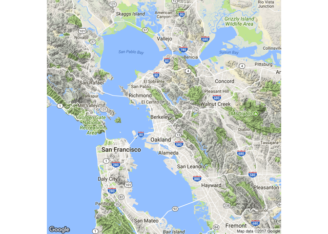

Slightly complicating our examle, we add an argument zoom = numeric to zoom in onto a segment of the map. It is best to play around with the numeric value for zoom to get a feel for how big or small a value you need for a particular purpose. Below, I zoomed in to identify the location of UC Berkeley.

``` r
qmap(location = "Berkeley", zoom = 14)
```

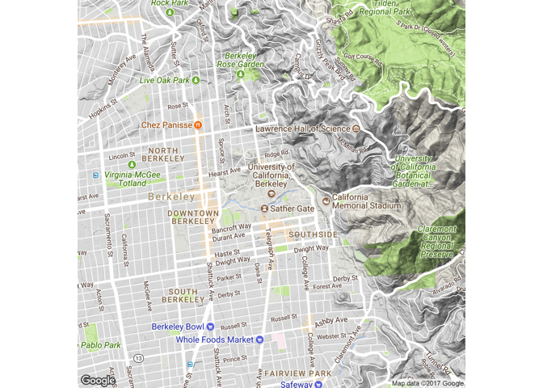

Moreover, the qmap() function allows us to specify aesthetic parameter. For instance, it is possible to (but why would you ever?) make the map appear in watercolor by simply telling qmap the maptype.

``` r
qmap(location = "Berkeley", zoom = 14, maptype = "watercolor")
```

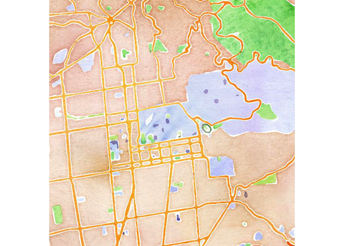

More practical example of this argument specification is mapetype="hybrid" that returns a satalite view map.

``` r
qmap(location = "Berkeley", zoom = 14, maptype = "hybrid")
```

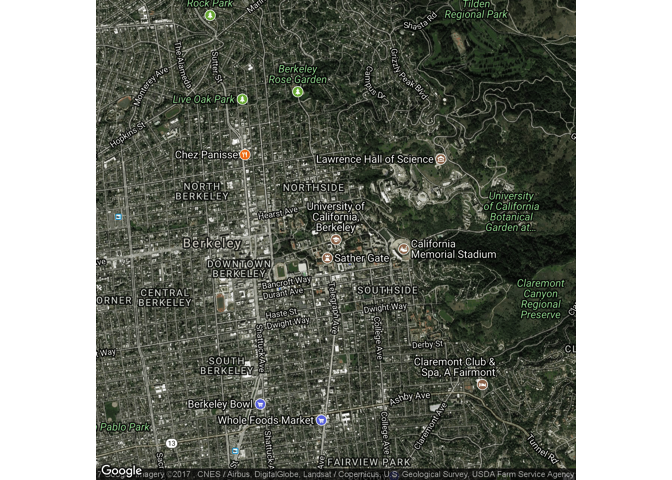

------------------------------------------------------------------------

Getting fancy (ggmap objects)
-----------------------------

To look into the structure of the ggmap object, let's get the map of the US. However, we will do this - not using qmap - but rather the actual ggmap function. The syntax is similar, as can be seen below. First we need to get geocode of the location, which is simply the latitude and longitude of the center of the location, as per Google maps.

``` r
usa_center = as.numeric(geocode("United States"))
usa_center
```

    [1] -95.71289  37.09024

Now, we tell ggmap to retrieve from google a piece of the map centered at the given coordinates. Scale and zoom allow us to get the image to the appropriate size to fit our needs. Extent specifies how much of the plot's base the map should take up. It takes three values: "normal", "device", or "panel", last one being default.

``` r
USAMap = ggmap(get_googlemap(center=usa_center, scale=2, zoom=4), extent="panel")
USAMap
```

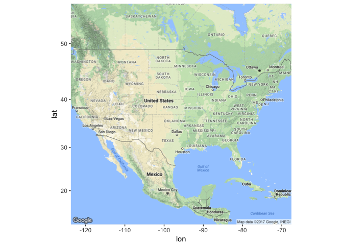

The map object is stored as a list of 9 and constitutes a beautiful and powerful visualization as we will see below.

------------------------------------------------------------------------

Add layers (adding data layer to the map)
-----------------------------------------

To add a layer of statistical data, we will require statistical data to visualize, of course. Let's load our data and get rid of unnecessary columns. For this post, we will only require the School name column and the Starting Salary column.

``` r
dat <- read_csv("../data/salaries-by-region.csv", col_types = c(`School Name` = col_character(),
  `Starting Median Salary` = col_integer()))
dat <- select(dat, c(1,3))
```

Now, ggmap requires coordinates to map places. In our data, we only have names of colleges and universities. Not to worry! A simple loop containing geocode fucntion will provide latitude and longitude of each school, recording it into two separate columns. Remember, geocode() returns a little data frame with two coordinates. So, let's record them as numeric vectors and attach them to our dataframe. *Warning*: This loop is very, and I mean very slow. If you are attempting to rerun this code on your computer, go get some coffee and enjoy five minutes staring out of the window as R connects to Google Maps and retrieves coordinates for each of the 300+ schools in our data frame.

``` r
#creat empty vectors
dat$lon <- c(rep(0, 320))
dat$lat <- c(rep(0, 320))
Points <- as.character(dat$`School Name`)
#Find geocode and assign lat and long values accordingly
for (i in 1:nrow(dat)) {
  latlon = geocode(Points[i])
  dat$lon[i] = as.numeric(latlon[1])
  dat$lat[i] = as.numeric(latlon[2])
}
```

Our data frame still has a little problem. Our salaries are recorded in a format as follows: $XX,XXX.

``` r
head(dat, n=3)
```

    # A tibble: 3 x 4
                                 `School Name` `Starting Median Salary`
                                         <chr>                    <chr>
    1                      Stanford University               $70,400.00
    2 California Institute of Technology (CIT)               $75,500.00
    3                      Harvey Mudd College               $71,800.00
    # ... with 2 more variables: lon <dbl>, lat <dbl>

R does not understand such values are numeric so we will have to assist R a little bit by making salary data appear numeric. For that, we use sub() function that performs replacement of all matches within a string.

``` r
#Getting rid of the $ sign
dat$`Starting Median Salary` <- sub('\\$','', dat$`Starting Median Salary`)
#Getting rid of the comma
dat$`Starting Median Salary` <- sub(',','',dat$`Starting Median Salary`)
#Character vector to numeric
dat$`Starting Median Salary` <- as.numeric(dat$`Starting Median Salary`)
```

Lastly, our data contains schools in Hawaii and Alaska but the USAMap object unfortunately doesn't. We will limit the visualization to all the states with the exception of Alaska and Hawaii by selecting only the rows in the data frame that have latitude and longitude within the borders of the map. The map of the USA above dictates the following boundries:

``` r
dat <- dat[dat$lon>(-130)&dat$lon<60&dat$lat>0&dat$lat<60, ]
```

Now we are ready to overlay USA map with statistical data. As in ggplot the + operator can be used. We start with the map object and add scatterplot of the lat vs lon of the schools. Alpha will be the parameter reflecting how much is the starting salary for the school graduates. So, darker regions have higher starting salary than more transparent ones. Because salary numbers are in thousands, we will have to normalize it by circle\_scale\_amt to make alpha value between 0 and 1.

``` r
circle_scale_amt = 0.000010
USAMap +
   geom_point(aes(x=lon, y=lat), data=dat, col="purple", alpha=dat$`Starting Median Salary`*circle_scale_amt,
              size=5) 
```

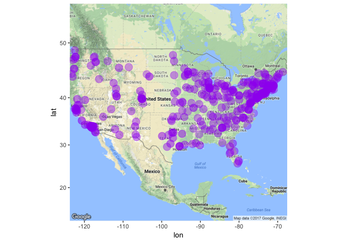

Taking this one step further, we can construct what is known as a heat map. At its core, heat map is a 2d density graph of the data, overimposed onto the map object.

``` r
USAMap +
    geom_density2d(data = dat, aes(x = lon, y = lat), colour = "blue") 
```

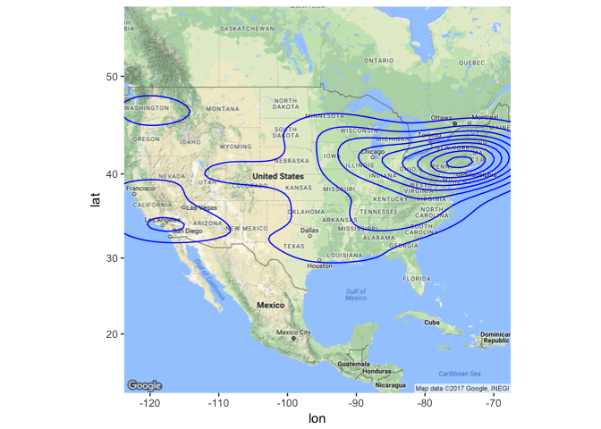

To construct a heat map all we now need to do is specify that fill and alpha both depend on the level. Here, level is set to the relative amount of layers present in the region so color of fill and alpha are both indicative of relative salary in the region. We tell ggmap to scale the fill as specified and scale alpha as specified. Naturally, these parameters can be modified by the user to make the map aesthetically pleasing.

``` r
#Base Map
heatmap <- USAMap + geom_density2d(data = dat, aes(x = lon, y = lat), size = 0.3) + 
#Adding 2d density and specifying aestetics. 
  stat_density2d(data = dat, 
                 aes(x = lon, y = lat, fill = ..level.., alpha = ..level..), size = 0.01, 
                 bins = 200, geom = "polygon") +
#scaling fill and alpha
scale_fill_gradient(low = "green", high = "red") + 
  scale_alpha(range = c(0, 0.3), guide = FALSE)
heatmap
```

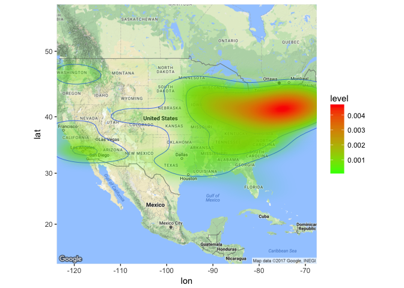

*Note*: In fact, behind the curtains, ggplot computes new values and creates new data frames for level, alpha and fill variables corresponding to each point in the data. Then, the ..level.. tells ggplot to reference that column in the newly build data frame.

``` r
build <- ggplot_build(heatmap)
select(head(build$data[[5]], n=3), 1:5)
```

         fill alpha        level         x        y
    1 #00FF00     0 2.339191e-05 -123.7939 29.91529
    2 #00FF00     0 2.339191e-05 -123.2258 29.83335
    3 #00FF00     0 2.339191e-05 -122.6576 29.76532

------------------------------------------------------------------------

Adjusting aesthetics (one more example)
---------------------------------------

Now let's use the map of CA as an example and figure out how we can make our visualization even more aesthetically pleasing.

Loading CA map should already be a familiar procedure.

``` r
cal_center = as.numeric(geocode("California"))
CalMap = ggmap(get_googlemap(center=cal_center, scale=2, zoom=7), extent="normal")
CalMap
```

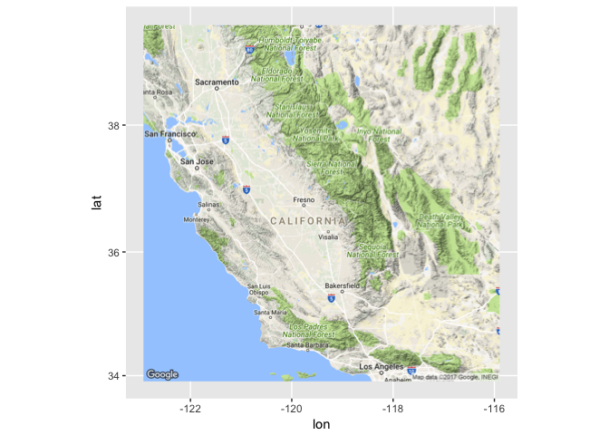

So is adding statistical layer to it. We sort through all the rows of the data to only select the ones that correspond to the CA geographical boundries that we can determine from the map above.

``` r
circle_scale_amt = 0.0001
dat <- dat[dat$lon>(-130)&dat$lon<(-116),]
dat <- dat[dat$lat>(34)&dat$lat<(38),]
CalMap +
   geom_point(aes(x=lon, y=lat), data=dat, col="purple", alpha=0.5,
              size=dat$`Starting Median Salary`*circle_scale_amt) 
```

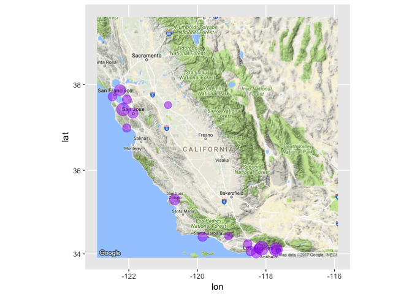

We write the same code as in the previous examples, but this time the starting salary is reflected in the color of the points rather than in their alpha or size. As expected, we just replace scale\_fill\_Gradient with scale\_colour\_gradient and we are all set.

``` r
CalMap +
geom_point(data = dat, mapping = aes(x = dat$lon, y = dat$lat, color = `Starting Median Salary`), size = dat$`Starting Median Salary`*0.0001) +
scale_colour_gradient(low = "hotpink",high = "yellow")
```

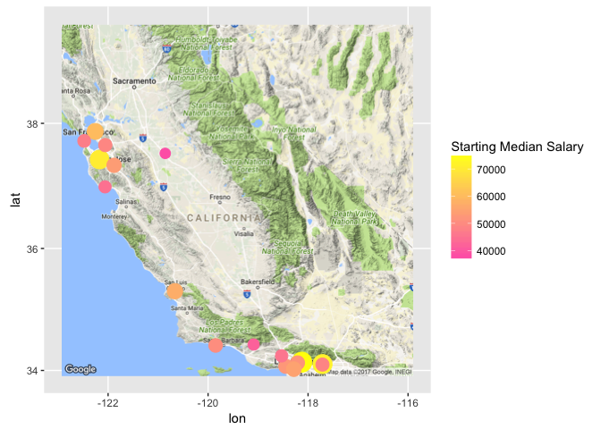

------------------------------------------------------------------------

Conclusion
----------

Complicated? No. Fun? Yes. As we have seen ggmap package is full of useful tools to help useRs create handy and beautiful visualizations of geographical data. if you need to pull up the map of a location quickly, consider using qmap(). ggmap function takes coordinates to retrieve a corresponding segment of the map. You can get the coordinates using geocode() function. To add a layer of statistical data, use ggmap object in combination with ggplot. Such maps are highly customizable and are designed to reflect a lot of data.

Hope you enjoyed reading this post!

------------------------------------------------------------------------

References
----------

1.  <https://stat.ethz.ch/pipermail/r-help/2010-May/237909.html>
2.  <https://statisticianinstilettosblog.wordpress.com/2017/03/10/a-simple-tutorial-of-ggmap-in-r/>
3.  <http://www.milanor.net/blog/maps-in-r-plotting-data-points-on-a-map/>
4.  <https://blog.dominodatalab.com/geographic-visualization-with-rs-ggmaps/>
5.  <https://cengel.github.io/rspatial/4_Mapping.nb.html>
6.  <https://www.kaggle.com/wsj/college-salaries/data>
7.  <http://www.kevjohnson.org/making-maps-in-r-part-2/>
8.  <http://eriqande.github.io/rep-res-web/lectures/making-maps-with-R.html>
9.  <https://cran.r-project.org/web/packages/ggmap/ggmap.pdf>
10. <https://stackoverflow.com/questions/32206623/what-does-level-mean-in-ggplotstat-density2d/>
